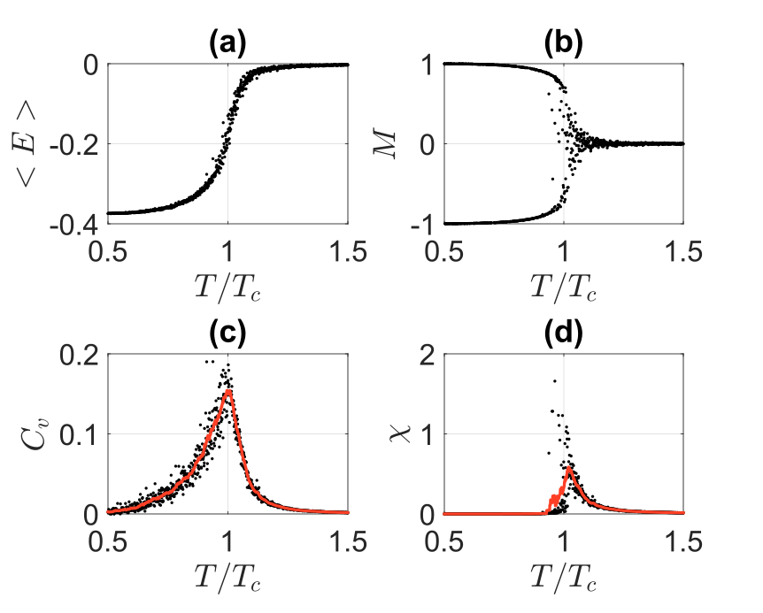
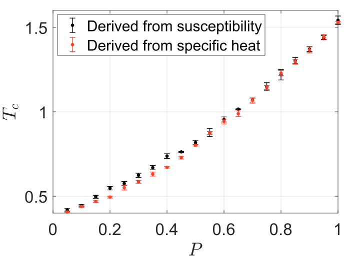

# Ising-Model-Honeycomb
 Ising model simulation for honeycomb and triangular lattice. This code is originally from https://www.mathworks.com/matlabcentral/fileexchange/62194-ising-model-and-metropolis-algorithm for square lattice. Our detailed model for analytical solution and simulation are available from the [slides](./Critical%20Point%20of%20a%202D%20Ising%20Honeycomb.pptx) and [report](./Critical_Point_of_a_2D_Ising_Honeycomb_Lattice.pdf). Any discussion is welcome!

  
 # Usage

The matlab live script files (.mlx) are example to run the code for different kinds of lattice (Triangular, honeycomb and square lattice). 
If you want to simulate the lattice with impurity and defect lattice, replace initSpins with initSpinsImpurity in your simulation.

# Results

regular Hexagon lattice:

Honeycomb lattice with impurity:

Honeycomb lattice with missing spins:

